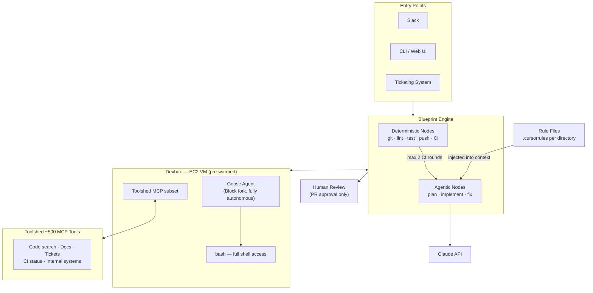
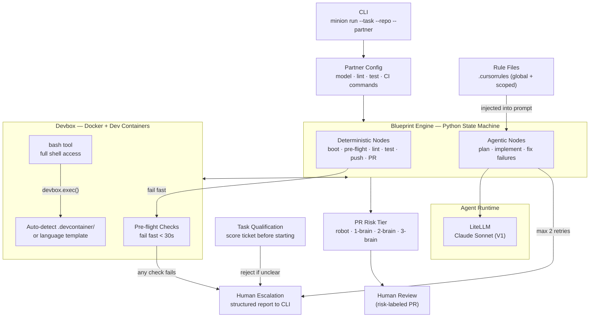
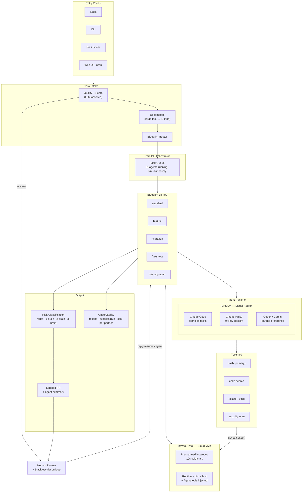

# Architecture Diagrams
> Paste each block into Excalidraw → Insert → Mermaid

---

## 1. Stripe Minions

```mermaid
flowchart TD
    subgraph ENTRY["Entry Points"]
        E1["Slack"]
        E2["CLI / Web UI"]
        E3["Ticketing System"]
    end

    subgraph BLUEPRINT["Blueprint Engine"]
        B1["Deterministic Nodes\ngit · lint · test · push · CI"]
        B2["Agentic Nodes\nplan · implement · fix"]
    end

    subgraph DEVBOX["Devbox  —  EC2 VM (pre-warmed)"]
        D1["Goose Agent\n(Block fork, fully autonomous)"]
        D2["bash  —  full shell access"]
        D3["Toolshed MCP subset"]
    end

    subgraph TOOLSHED["Toolshed  ~500 MCP Tools"]
        T1["Code search · Docs · Tickets\nCI status · Internal systems"]
    end

    LLM["Claude API"]
    RULES["Rule Files\n.cursorrules per directory"]
    HUMAN["Human Review\n(PR approval only)"]

    ENTRY --> BLUEPRINT
    BLUEPRINT <--> DEVBOX
    D3 <--> TOOLSHED
    D1 --> D2
    B2 --> LLM
    RULES -->|"injected into context"| B2
    B1 -->|"max 2 CI rounds"| B2
    BLUEPRINT --> HUMAN
```

---

## 2. Our V1 Design

```mermaid
flowchart TD
    CLI["CLI\nminion run --task --repo --partner"]
    CFG["Partner Config\nmodel · lint · test · CI commands"]

    subgraph BLUEPRINT["Blueprint Engine  —  Python State Machine"]
        direction TB
        DET["Deterministic Nodes\nboot · pre-flight · lint · test · push · PR"]
        AG["Agentic Nodes\nplan · implement · fix failures"]
    end

    subgraph DEVBOX["Devbox  —  Docker + Dev Containers"]
        DC["Auto-detect .devcontainer/\nor language template"]
        PF["Pre-flight Checks\nfail fast < 30s"]
        SH["bash tool\nfull shell access"]
    end

    subgraph AGENT["Agent Runtime"]
        LITELLM["LiteLLM\nClaude Sonnet (V1)"]
    end

    RULES["Rule Files\n.cursorrules (global + scoped)"]
    QUAL["Task Qualification\nscore ticket before starting"]
    RISK["PR Risk Tier\nrobot · 1-brain · 2-brain · 3-brain"]
    ESC["Human Escalation\nstructured report to CLI"]
    HUMAN["Human Review\n(risk-labeled PR)"]

    CLI --> CFG --> BLUEPRINT
    BLUEPRINT <--> DEVBOX
    SH -->|"devbox.exec()"| DC
    AG --> LITELLM
    RULES -->|"injected into prompt"| AG
    QUAL -->|"reject if unclear"| ESC
    DET -->|"fail fast"| PF
    PF -->|"any check fails"| ESC
    AG -->|"max 2 retries"| ESC
    BLUEPRINT --> RISK --> HUMAN
```

---

## 3. Final Design  (V4)

```mermaid
flowchart TD
    subgraph ENTRY["Entry Points"]
        E1["Slack"]
        E2["CLI"]
        E3["Jira / Linear"]
        E4["Web UI · Cron"]
    end

    subgraph INTAKE["Task Intake"]
        Q["Qualify + Score\n(LLM-assisted)"]
        DECOMP["Decompose\n(large task → N PRs)"]
        ROUTE["Blueprint Router"]
    end

    subgraph QUEUE["Parallel Orchestrator"]
        POOL["Task Queue\nN agents running simultaneously"]
    end

    subgraph BLUEPRINTS["Blueprint Library"]
        BP1["standard"]
        BP2["bug-fix"]
        BP3["migration"]
        BP4["flaky-test"]
        BP5["security-scan"]
    end

    subgraph DEVBOX["Devbox Pool  —  Cloud VMs"]
        VM["Pre-warmed instances\n10s cold start"]
        LAYERS["Runtime · Lint · Test\n+ Agent tools injected"]
    end

    subgraph AGENT["Agent Runtime"]
        subgraph MODELS["LiteLLM — Model Router"]
            M1["Claude Opus\ncomplex tasks"]
            M2["Claude Haiku\ntrivial / classify"]
            M3["Codex / Gemini\npartner preference"]
        end
    end

    subgraph TOOLS["Toolshed"]
        T1["bash  (primary)"]
        T2["code search"]
        T3["tickets · docs"]
        T4["security scan"]
    end

    subgraph OUTPUT["Output"]
        RISK2["Risk Classification\nrobot · 1-brain · 2-brain · 3-brain"]
        PR["Labeled PR\n+ agent summary"]
        OBS["Observability\ntokens · success rate · cost per partner"]
    end

    HUMAN["Human Review\n+ Slack escalation loop"]

    ENTRY --> INTAKE
    Q -->|"unclear"| HUMAN
    Q --> DECOMP --> ROUTE --> POOL
    POOL --> BLUEPRINTS
    BLUEPRINTS <--> DEVBOX
    BLUEPRINTS --> AGENT
    AGENT --> TOOLS
    TOOLS -->|"devbox.exec()"| DEVBOX
    BLUEPRINTS --> RISK2 --> PR --> HUMAN
    BLUEPRINTS --> OBS
    HUMAN -->|"reply resumes agent"| BLUEPRINTS
```
